# Contactos de WhatsApp

Queremos construir una aplicación para mantener una agenda de contactos de WhatsApp.

De un contacto mantenemos, además del número de teléfono, los datos que aparecen en la clase siguiente:

```plantuml
@startuml
skinparam classAttributeIconSize 0
skinparam nodesep 100
skinparam ranksep 80

class Contacto {
- nombre: String
- apellidos: String
- email: String
}

@enduml
```



El programa mostrará un menú como el siguiente:

```text
CONTACTOS
---------
	0. Salir
Gestión de contactos
	1. Nuevo contacto.
	2. Eliminar contacto.
Búsqueda
	3. Buscar contacto por número de teléfono.
	4. Buscar contacto por nombre.
Listados
	5. Listado de todos los contactos, tal como se han añadido.
	6. Listado de todos los contactos, ordenados por número de teléfono.
```

El programa principal pedirá al usuario todos los datos necesarios y creará los objetos que hagan falta.

## Sugerencias

- Para almacenar la información se recomienda usar el interfaz `Map<K,V>`, donde `K` sea el teléfono y `V` el contacto,
  aunque no tiene por qué ser la única estructura que usemos.

## Restricciones

- No se puede añadir el atributo `telefono` a la clase `Contacto`.
- No hay límite en el máximo de contactos que podemos almacenar en el sistema.
- El programa no termina hasta que se elija la opción de salir.
- Es obligatorio tratar las posibles excepciones de forma adecuada.
